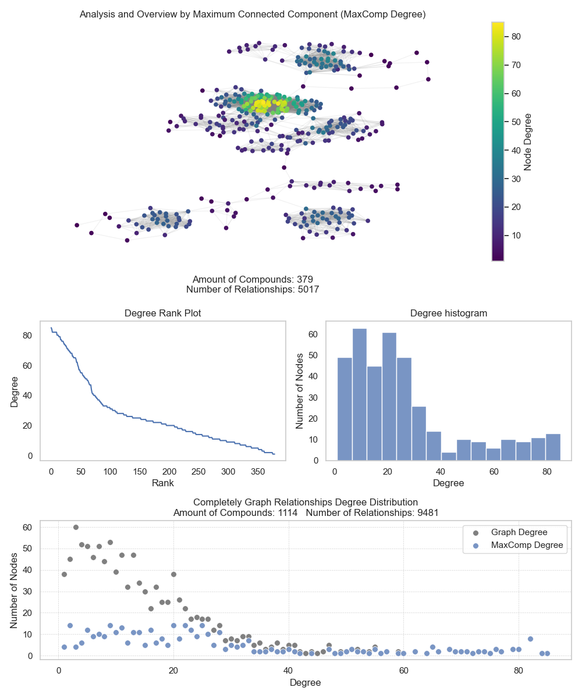

<p> </p>
<p> </p>

<h1 align="justify">
A Flexible Information Retrieval Architecture for Exploring and Assembling Molecular Space Domains For Drug Discovery Based on Computer-Aided Drug Design Strategies.
</h1>

<p> </p>
<p> </p>

<div style="display: inline-block;" align="center">
 
 
 


</div>

<p> </p>
<p> </p>

<div align="justify">

Managing the vast and complex data involved in analyzing compound–target relationships has become a growing challenge in computer-aided drug design (CADD). Large drug repositories, enriched with heterogeneous and voluminous metadata, often exceed the capabilities of traditional exploration strategies. As a result, building comprehensive and reliable research datasets is both costly and time-consuming. Moreover, defining robust methodologies for each drug discovery project requires clear rules to assess data quality, while also addressing missing, redundant, or inconsistent information, which further complicates the process.

BioMolExplorer was developed to overcome these challenges by providing an efficient and systematic approach to data management. The tool integrates and standardizes information from widely used drug databases such as PDB, ChEMBL, and ZINC, ensuring the generation of well-structured and research-ready datasets. By focusing on molecular entities associated with predefined therapeutic targets, BioMolExplorer ensures the retrieval of relevant and high-value information, streamlining the overall research workflow.

Its strategy enables the collection of bioactive molecules, structurally similar analogs, and enzyme complexes, all of which are essential for drug discovery and repositioning studies. Furthermore, its diverse filtering mechanisms allow researchers to tailor the extracted data to specific project requirements and scientific domains, significantly enhancing the precision and productivity of exploratory analyses. In addition, BioMolExplorer incorporates within its framework an automated redocking evaluation step within its framework, powered by the AutoDock Vina strategy, which enables a systematic assessment of the extracted proteins. This feature provides a curation layer for the downloaded PDB structures, ensuring validation of their quality and strengthening the reliability of downstream analyses.

</div>

#### Key Advantages:

> 1. **Comprehensive Data Retrieval**: Access to extensive drug banks of bioactive compounds and molecular structures is essential for robust drug discovery.
> 2. **Enhanced Target-Specific Insights**: Detailed analysis of molecular interactions aids in uncovering new drug candidates and understanding mechanisms of efficacy.
> 3. **Streamlined Data Processing**: Minimizes the need for labor-intensive preliminary data evaluations, enabling researchers to engage directly with high-quality, pertinent data.
> 4. **Support for Advanced Analytical Techniques**: The rich datasets support advanced analytical methods, enhancing drug discovery through predictive modeling and pattern recognition.
> 5. **Custom filters**: Enables information retrieval based on specific research constraints, facilitating the composition of data domain spaces that align with research objectives.
> 6. **Automated Redocking-Based Validation**: AutoDock Vina–based redocking module for protein quality assessment, ensuring reliable curation and reproducible datasets.

<p> </p>
<p> </p>

## Molecular Pre-Analysis and Modeling

<div align="justify">

This stage is dedicated to structuring drug–relationship networks and performing clustering analyses based on molecular signature affinity models. The signatures generated for each molecule serve as descriptors for evaluating the connectivity and organization of these networks. By identifying the maximum connected component and quantifying molecular similarity, BioMolExplorer enables the clustering and systematic assessment of compounds with shared signatures. This process supports the recognition of potential scaffolds (i.e., common molecular fragments) and the management of compound overlap constraints, particularly relevant in multi-target investigations. Such an approach substantially strengthens the development of advanced strategies for both drug discovery and drug repositioning. Figure 1 illustrates the identification of maximum connected components and common molecular fragments within the research process.

<div align="center">

</div>

<h6 align="justify">
Figure 1: Representation of variance in molecular structural feature overlap within a network model. Node relevance (i.e., the importance of each molecule) is evaluated in relation to the therapeutic target and its most prominent clinical investigations, as reported in the ChEMBL database. The in-degree rank plot illustrates the relationship between nodes and their interaction counts, while the degree histogram shows the distribution of key nodes across the network. The complete graph analysis highlights the overall degree distribution, emphasizing the role of the maximum connected component in capturing the most significant structural relationships.
</h6>

The largest connected component approach strengthens the identification of overlapping molecular features, particularly when applying multi-target strategies. This method enables the extraction of chemical signatures based on shared structural and functional properties, highlighting groups of compounds with the highest chemical similarity.

By focusing on the most significant connected component, BioMolExplorer provides a more robust framework for analyzing compounds most likely to interact with therapeutic targets or exhibit similar pharmacological profiles. At the same time, this strategy reduces noise in the chemical space under investigation and mitigates computational complexity, improving both efficiency and interpretability.

</div>

#### Benefits:

> 1. **Enhanced Data Organization**: Molecular information is structured into coherent clusters, facilitating efficient interpretation and comparative analysis.
> 2. **Identification of Key Molecular Interactions**: Evaluation of bond coefficients supports the detection of critical interactions relevant to drug discovery and repositioning.
> 3. **Efficient Drug Candidate Selection**: Clustering by molecular signature affinity streamlines the prioritization of promising drug candidates for subsequent validation.
> 4. **Support for Advanced Analytical Techniques**: Well-structured outputs enable the application of predictive modeling, pattern recognition, and other advanced computational approaches.
> 5. **Scaffold-Centric Exploration**: Analysis of maximum common scaffolds (cluster centroids) introduces an additional level of virtual screening, aiding in the exploration of shared structural cores within the chemical space.


# 🎯 How to BioMolExplorer on Linux Systems

BioMolExplorer is designed to run in Linux environments, and its installation process relies on directives specific to this operating system. To accommodate different Linux distributions, we provide two installation methods. The first is a generic approach applicable across distributions, while the second is an automated method tailored to the Ubuntu 24.04 distribution.

## 1. General installation dependencies

1.1 ***Anaconda***
    - Download the latest version of Anaconda from the [Anaconda website](https://www.anaconda.com/download).
    - Make the downloaded installer executable with:
      ```bash
      chmod +x <downloaded_file.sh>
      ```
    - Install Anaconda by running the installer script:
      ```bash
      ./<downloaded_file.sh>
      ```

1.2 ***Create the Environment for BioMolExplorer***
    - Copy the BioMolExplorer folder to your preferred location on your system.
    - Navigate to the directory containing the `requirements.yml` file and create the conda environment with:
      ```bash
      conda env create -f environment.yml
      ```

1.3 ***Chimera***
    - Download the latest version of Chimera from the [Chimera website](https://www.cgl.ucsf.edu/chimera/download.html).
    - Make the downloaded installer executable with:
      ```bash
      chmod +x <downloaded_file.bin>
      ```
    - Install Chimera by running the installer script:
      ```bash
      ./<downloaded_file.bin>
      ```


## 2. Ubuntu Linux distribution

2.1 ***Download Anaconda and Chimera***
    - Create an `apps` folder inside the main `BioMolExplorer` directory, if it does not already exist.
    - Place the Anaconda and Chimera installers in the `apps` folder.
    - Rename the Anaconda installer to `Anaconda-latest-Linux-x86_64.sh`.
    - Rename the Chimera installer to `chimera.bin`.

2.2 ***Alternative Method to Configure the Environment***
    - Navigate to the directory containing the `install.sh` file and perform:
      ```bash
      chmod +x install.sh
      ./install.sh
      ```


## 3. Running BioMolExplorer

1. ***Using Visual Studio Code (VSCode)***
    - Download and install Visual Studio Code from the Ubuntu Software Center or the [official website](https://code.visualstudio.com/).

2. ***Configure VSCode***
    - Open VSCode and install the Python plugin from the Extensions marketplace.
    - Set the Python interpreter to the one associated with your Anaconda environment by selecting it from the Command Palette (`Ctrl+Shift+P`) and searching for "Python: Select Interpreter."
    - Locate BioMolExplorer in the presented list and select it.

3. ***Execute BioMolExplorer Scripts***
- Open the `BioMolExplorer` project folder in VSCode.
- Run the Python scripts located in the `workflow` folder in the following sequence:

  1. ***InformationRetrieval***: This stage performs data extraction from the **PDB**, **ChEMBL**, and **ZINC** datasets. For PDB, filters are applied through predefined functions. ChEMBL data is extracted using scripts and filters located in `src/scripts/crawlers`. Extraction from ZINC requires obtaining the dataset URIs from the official ZINC site and configuring their paths in BioMolExplorer to enable proper information retrieval.

  2. **Analysis**: The data analysis stage consists of three phases:  
     a) **Generate fingerprints** for molecular entities.  
     b) **Produce similarity references** based on molecular signatures.  
     c) **Analyze complex networks** to identify relationships and clustering patterns.  
     
     Additionally, the **redocking step** allows evaluation of PDB structures, providing a quality assessment of the extracted proteins.
      

## 4. How to configure BioMolExplorer for a specific target

To process your data, the project is organized into two main stages located in the `workflow` folder. Follow the order below to ensure data integrity and the correct generation of results.

### 4.1. Retrieval Stage: `workflow/InformationRetrieval`

This stage is responsible for the extraction and standardization of data from public databases. Execute the scripts in the following order:

* **`11-pdb.py`**: Performs the loading of protein structures from the PDB. It allows filtering by Enzyme Commission (EC) number, resolution, and whether the presence of ligands in the complex is mandatory.
* **`12-chembl.py`**: A crawler focused on extracting bioactivities and information on biological targets from the ChEMBL database.
* **`13-zinc.py`**: Manages the collection of compound libraries based on configured URIs, focused on obtaining 3D structures for virtual screening.

---

#### 📦 PDB Download Configuration Guide

This section describes how to configure and execute the following Python function:

```python
load_pdb(
    target='Monoamine Oxidase B', 
    base_output_path='/datasets', 
    pdb_ec='1.4.3.1',
    PolymerEntityTypeID=[PolymerEntityType.PROTEIN],
    ExperimentalMethodID=[ExperimentalMethod.X_RAY_DIFFRACTION],
    max_resolution=2.0, 
    must_have_ligand=True
)
```

🔍 Overview

The `load_pdb` function is designed to retrieve protein structures from the Protein Data Bank (PDB) according to user-defined criteria. Each parameter allows fine control over the type and quality of structural data being downloaded.


⚙️ Parameter Description

**1. `target` and `base_output_path`**

* `target`: Defines the name of the main folder where the downloaded data will be stored.
* `base_output_path`: Specifies the root directory in which the folder defined by `target` will be created.

📁 **Resulting structure example:**

```
/datasets/Monoamine Oxidase B/
```


**2. `pdb_ec` (Enzyme Commission Number)**

* This parameter specifies the **Enzyme Commission (EC) number**, which uniquely identifies enzyme classes based on the reactions they catalyze.
* The EC number is obtained from the Protein Data Bank (PDB) or related biochemical databases.

🔬 **Example:**

* `'1.4.3.1'` corresponds to Monoamine Oxidase enzymes.


**3. `PolymerEntityTypeID`**

* Defines the **type of macromolecule** to be retrieved.
* This helps restrict the search to specific biological entities.

🧬 **Common options include:**

* `PROTEIN` → protein structures
* `DNA` → DNA molecules
* `RNA` → RNA molecules

✔️ In this example:

```python
[PolymerEntityType.PROTEIN]
```

Only protein structures will be downloaded.


**4. `ExperimentalMethodID`**

* Specifies the **experimental technique** used to determine the structure.

🔬 **Common methods include:**

* `X_RAY_DIFFRACTION`
* `NMR`
* `CRYO_EM`

✔️ In this case:

```python
[ExperimentalMethod.X_RAY_DIFFRACTION]
```

Only structures solved via X-ray crystallography will be considered.


**5. `max_resolution`**

* Defines the **maximum resolution (in Ångströms)** allowed for the selected structures.
* Lower values correspond to **higher structural quality**.

📏 **Example:**

```python
max_resolution=2.0
```

Only structures with resolution ≤ 2.0 Å will be downloaded.


**6. `must_have_ligand`**

* Indicates whether the retrieved structures must contain a **bound ligand**.

⚖️ Options:

* `True` → Only structures with ligands are included
* `False` → Structures without ligands are also allowed

✔️ In this example:

```python
must_have_ligand=True
```

Only ligand-bound structures will be retrieved.

---

#### 🧪 ChEMBL Data Extraction Guide

This section explains how to configure and run the following script to extract data from the ChEMBL database:

```python
load_chembl(
    target_name='monoamine oxidase',
    base_output_path='/datasets'
)
```


🔍 Overview

The `load_chembl` function is responsible for retrieving chemical and bioactivity data associated with a specific biological target from the ChEMBL database. The process is customizable through predefined filters that control what type of data is collected.


⚙️ Main Parameters

**1. `target_name`**

* Defines the **name of the biological target**.
* ⚠️ This name must match exactly how the target is defined in the ChEMBL database.

✔️ Example:

```python
target_name='monoamine oxidase'
```


**2. `base_output_path`**

* Specifies the **directory where the extracted data will be stored**.

📁 Example:

```python
base_output_path='/datasets'
```


🧩 Additional Extraction Scripts

Beyond the main function, the system includes several auxiliary scripts located in:

```
src > scripts > crawlers
```

These scripts enable the extraction of different types of data using predefined filters, including:

* Therapeutic targets
* Bioactivity data
* Molecules
* Similar compounds


🧬 Filter Configurations

Below are the main filters used during the extraction process.


**1. Therapeutic Target Filters**

```json
{
    "organism": "Homo sapiens",
    "type__in": ["SINGLE PROTEIN"],
    "relationship_type": "DIRECT"
}
```

**Explanation:**

* `organism`: Selects targets from human organisms.
* `type__in`: Filters for specific target types (e.g., single proteins).
* `relationship_type`: Defines how the target relates to the `target_name` provided.


**2. Bioactivity Filters**

```json
{
    "standard_type__in": ["Ki", "IC50"],
    "molecule_type": "small molecule",
    "max_value_ref": 1000,
    "standard_units": "nM"
}
```

**Explanation:**

* `standard_type__in`: Types of activity measurements (e.g., binding affinity).
* `molecule_type`: Restricts to small molecules.
* `max_value_ref`: Maximum accepted activity value.
* `standard_units`: Unit of measurement (nanomolar).

**3. Molecule Filters**

```json
{
    "natural_product": 0
}
```

**Explanation:**

* `natural_product`:

  * `1` → include natural products
  * `0` → exclude natural products


**4. Similar Compound Filters**

```json
{
    "similarity": 60,
    "natural_product": 0,
    "molecule_type": "small molecule",
    "molecule_weight": 500
}
```

**Explanation:**

* `similarity`: Minimum similarity percentage compared to retrieved molecules.
* `natural_product`: Include or exclude natural products.
* `molecule_type`: Restricts to small molecules.
* `molecule_weight`: Maximum molecular weight allowed.


---

#### 🧬 ZINC Data Extraction Guide

This section describes how to configure and execute the script used to retrieve molecular data from the ZINC database.

```python
load_zinc(
    base_output_path='/datasets/ZINC',
    filename='ZINC2D.uri',
    verbose=True
)
```

🔍 Overview

The `load_zinc` function processes a file containing **URIs for SMILES strings** obtained from the ZINC database. These URIs are used to download molecular structures and organize them locally.

⚠️ **Important:** Before running this script, the URI file must be downloaded manually from the ZINC database.


⚙️ Parameters

**1. `base_output_path`**

* Specifies the **directory where the URI file is located** and where the downloaded data will be stored.

📁 Example:

```python
base_output_path='/datasets/ZINC'
```


**2. `filename`**

* Defines the **name of the URI file** downloaded from ZINC.
* This file contains links that point to molecular data (SMILES format).

📄 Example:

```python
filename='ZINC2D.uri'
```


### **3. `verbose`**

* Controls whether the script displays progress information in the terminal during execution.

⚖️ Options:

* `True` → Displays detailed progress (recommended for monitoring)
* `False` → Runs silently without output

✔️ Example:

```python
verbose=True
```


▶️ How to Use

**Step 1 — Download the URI File**

* Access the ZINC database and download a file containing URIs for SMILES data (e.g., `ZINC2D.uri`).
* Save this file in your desired directory.


**Step 2 — Configure the Script**

* Set `base_output_path` to the directory where the file is located
* Provide the correct `filename`
* Choose whether to enable progress visualization using `verbose`


### 4.2. Analysis Stage: `workflow/Analysis`

After retrieval, this stage processes the data, validates structures, and generates similarity models:

* **`21-redocking.py`**: Executes the automated redocking process using **AutoDock Vina**. This script prepares the complexes and calculates the RMSD to validate the quality of the downloaded PDB structures, serving as an essential curation layer for subsequent analyses.
* **`22-dataAnalysis.py`**: Performs advanced data processing in three phases:
    1. **Fingerprint Generation**: Creates Morgan, MACCS, and Pharmacophore descriptors.
    2. **Similarity Calculation**: Computes metrics (e.g., Tanimoto) to compare molecular entities.
    3. **Network Analysis**: Constructs molecular affinity graphs, identifying connected components and common scaffolds, facilitating the identification of drug candidates.


#### 🔁 Redocking Procedure Guide

This section explains how to configure and execute the redocking process using the following script:

```python
perform_redocking(
    base_input_path='/datasets/PDB',
    target='MonoamineOxidaseB',
    base_output_path='/resultados/redocking',
    prepare_complex=True,
    charge_type='am1'
)
```

🔍 Overview

The `perform_redocking` function performs a **redocking workflow**, in which previously known protein–ligand complexes are reprocessed and docked again to validate docking protocols or assess reproducibility.

The script operates on a set of Protein Data Bank (PDB) structures and optionally prepares the molecular complexes prior to docking.


⚙️ Parameters

### **1. `base_input_path`**

* Defines the **root directory containing the PDB structures** to be used in the redocking process.

📁 Example:

```python
base_input_path='/datasets/PDB'
```

**2. `target`**

* Specifies the **target of interest**, corresponding to a subdirectory inside `base_input_path`.

📁 Example:

```python
target='MonoamineOxidaseB'
```

✔️ Expected structure:

```
/datasets/PDB/MonoamineOxidaseB/
```

**3. `base_output_path`**

* Defines the **directory where all redocking results will be stored**.

📁 Example:

```python
base_output_path='/resultados/redocking'
```

**4. `prepare_complex`**

* Determines whether the protein–ligand complexes should be **prepared before docking**.

⚖️ Options:

* `True` → Enables preparation (recommended)
* `False` → Skips preparation

✔️ When enabled:

* A subfolder named `Prepared` is created inside the target directory
* Receptor and ligand preprocessing is performed automatically


**5. `charge_type`**

* Specifies the **charge model** applied during ligand preparation.

⚡ Example:

```python
charge_type='am1'
```

* Commonly used for semi-empirical charge assignment


🧩 Complex Preparation Workflow

When `prepare_complex=True`, the system uses auxiliary scripts located at:

```
src > scripts > chimera
```

These scripts rely on command-line operations from **UCSF Chimera** to process molecular structures in the background.


🧬 Template Script for Complex Preparation

The main preparation logic is defined in the following template:

```bash
open {input_complex}.pdb
delete solvent
delete element.H
select #0:.{chain} | :FAD
select invert
delete selected
write format pdb #0 {output_complex}.complex.pdb
close session
close all
```

✏️ Customization Guidelines

**Editable Section**

It is recommended to modify **only the following line**:

```bash
select #0:.{chain} | :FAD
```

* This line defines which parts of the structure are retained.
* `| :FAD` indicates inclusion of a **cofactor (FAD)**.

**Examples:**

✔️ Include cofactor:

```bash
select #0:.{chain} | :FAD
```

✔️ Exclude cofactor:

```bash
select #0:.{chain}
```

### ⚠️ Important Notes

* All other commands in the script should be kept **unchanged** to ensure correct processing.
* Advanced users familiar with **Chimera terminal commands** may extend or modify the scripts.
* The system is designed to execute these commands **in the background**, following Chimera’s syntax and behavior.

--- 

#### 📊 Data Analysis Workflow Guide

This section describes the main steps implemented in the `dataAnalysis.py` script, located in the `workflow` folder. The workflow is responsible for transforming molecular data into meaningful similarity relationships and graph-based representations.

🔍 Overview

The analysis pipeline is composed of three main stages:

1. **Fingerprint generation**
2. **Similarity computation**
3. **Graph-based analysis**

Each stage builds upon the previous one, forming a structured workflow for molecular comparison and exploration.


🧬 1. Fingerprint Generation

```python
generate_fingerprints(
    base_input_path='/datasets/ChEMBL/DrugBank',
    morgan=True,
    maccs=True,
    pharmacophore=True
)
```

**Purpose**

This function converts molecular structures into **numerical representations (fingerprints)**, which are essential for computational comparison.

**Parameters**

* `base_input_path`: Directory containing molecular file defined by a csv description.
* `morgan`: Enables generation of **Morgan fingerprints** (circular fingerprints widely used in cheminformatics).
* `maccs`: Enables generation of **MACCS keys** (predefined structural keys).
* `pharmacophore`: Enables generation of **pharmacophore fingerprints** (captures functional features relevant for biological activity).

**Notes**

* Multiple fingerprint types can be generated simultaneously.
* These representations are stored in a subfolder (typically named `Fingerprints`) for subsequent analysis.


🔗 2. Similarity Computation

```python
compute_similarity(
    base_input_path='/datasets/ChEMBL/DrugBank/Fingerprints',
    base_output_path='/datasets/ChEMBL/DrugBank',
    metric=similarityFunctions.TanimotoSimilarity,
    fingerprint=fingerprints.Morgan                  
)
```

**Purpose**

This step computes **pairwise similarity scores** between molecules based on their fingerprints.

**Parameters**

* `base_input_path`: Directory containing previously generated fingerprints.
* `base_output_path`: Directory where similarity results will be saved.
* `metric`: Mathematical function used to compute similarity.

  * Common options: **Tanimoto**, Dice, Cosine.
* `fingerprint`: Specifies which fingerprint type to use in the comparison.

**Notes**

* The **Tanimoto similarity** is the most commonly used metric in cheminformatics.
* Results are typically stored in a `Similarity` folder.


🕸️ 3. Graph-Based Analysis

```python
analyze_graphs(
    base_input_path='/datasets/ChEMBL/DrugBank',
    base_output_path='/resultados/grafos',
    metric=similarityFunctions.TanimotoSimilarity,
    fingerprint=fingerprints.Morgan
)
```

**Purpose**

This function constructs **graph representations** of molecular relationships based on similarity values.

**Concept**

* Each molecule is represented as a **node**
* Similarity relationships above a given threshold form **edges**

This approach enables identification of:

* Molecular clusters
* Structural analogs
* Key compounds within a network

**Parameters**

* `base_input_path`: Directory containing similarity results.
* `base_output_path`: Directory where graph outputs will be stored.
* `metric`: Similarity metric used to define relationships.
* `fingerprint`: Fingerprint type used in the analysis.

---

# ▶️ How to Execute scripts in workflow folder

After configuring the parameters and filters:

1. Save the script as a `.py` file.
2. Navigate to the file location.
3. Right-click on the file.
4. Select the option to **run the script using Python via terminal**.

---


# 📄 How to Cite Our Work

If you use the data from this study in your research, please cite the dataset as follows:

**Full Reference:**

Pires da Silva, M., Alves de Oliveira, T., Habib Bechelane Maia, E., Oliveira Mendes, G., Cristina Moreira Damázio, L., Brito Barbosa, D., Andrade Leite, F. H., Falkoski, L., Flores de Souza Marra, I., Siqueira Valle, M., Silva Matos Andrade, L., Čmelo, I., Fayne, D., Batista de Carvalho, P., Marques da Silva, A., & Gutterres Taranto, A. (2025). *Data-driven chemical domain for polypharmacology agents: Focus on Alzheimer’s disease*. Mendeley Data. https://doi.org/10.17632/5njg46dfj4.3

**Example of in-text citation:**

> (Pires da Silva et al., 2025)

<p> </p>
<p> </p>

## Authors

| [<br><sub> Michel Pires da Silva</sub>](http://lattes.cnpq.br/1449902596670082) |  [<br><sub> Alisson Marques da Silva</sub>](http://lattes.cnpq.br/3856358583630209) |  [<br><sub> Alex Gutterres Taranto</sub>](http://lattes.cnpq.br/4759006674013596) |
| :---: | :---: | :---: |
